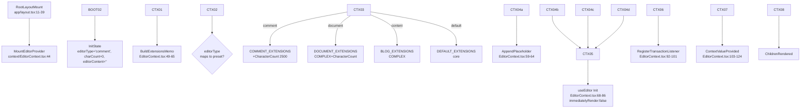
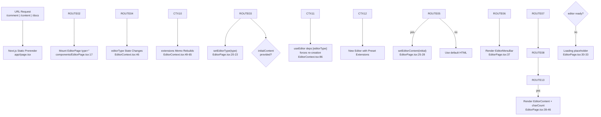
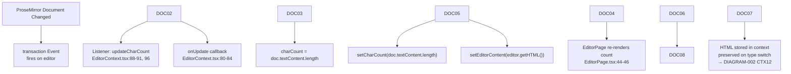
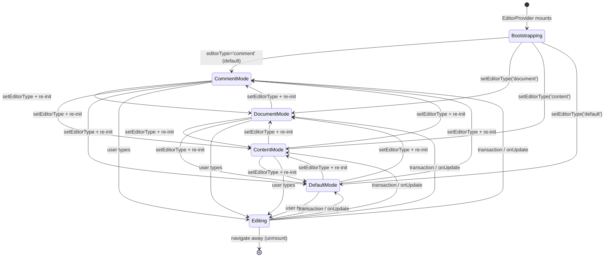
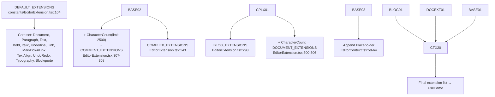

# Logic Flow Index (LFI) — DIAGRAMS

Companion to `LOGIC_FLOW_INDEX.md`. All node IDs follow the convention documented in
§8 of the master index and are traceable to source line ranges.

---

## Legend

```text
Node ID format: [AREA][NN]:[Type][Name]

Areas:
  BOOT  — bootstrap/layout
  ROUTE — route/page mount
  CTX   — editor context/useEditor
  MENU  — toolbar/menu
  MOD   — modal/model flows
  DOC   — document mutation

Types:
  Entry    — starting point
  Process  — processing step
  Decision — branching point
  Output   — result/return
  Error    — error handling
  External — external call (none exist in this project)
```

---

## DIAGRAM-001: Application Bootstrap

Traces PATH-001 and PATH-002 from the master LFI.



---

## DIAGRAM-002: Mode Route → Editor Shell

Traces PATH-003 and PATH-004.



---

## DIAGRAM-003: Toolbar Rendering & Command Execution

Traces PATH-005.

```mermaid
flowchart TD
    MENU01:Entry["EditorMenuBar Renders<br/>components/EditorMenuBar.tsx:33"] --> MENU02:Decision{"editor<br/>exists?"}
    MENU02 -->|no| MENU03:Output["return null<br/>EditorMenuBar.tsx:37"]
    MENU02 -->|yes| MENU04:Decision{"editorType?"}
    MENU04 -->|content| MENU05a:Process["CONTENT_MENU"]
    MENU04 -->|document| MENU05b:Process["DOCUMENT_MENU"]
    MENU04 -->|other| MENU05c:Process["MENU_BTN_ITEMS"]
    MENU05a --> MENU06:Process["Group items by item.group<br/>EditorMenuBar.tsx:47"]
    MENU05b --> MENU06
    MENU05c --> MENU06
    MENU06 --> MENU07:Decision{"item.type"}
    MENU07 -->|button| MENU08a:Process["Render Button<br/>isActive? → variant<br/>EditorMenuBar.tsx:58-77"]
    MENU07 -->|dropdown| MENU08b:Process["Render Select<br/>options list<br/>EditorMenuBar.tsx:80-144"]
    MENU07 -->|input| MENU08c:Process["Render controlled Input<br/>EditorMenuBar.tsx:147-172"]
    MENU07 -->|model| MENU08d:Process["Render Dialog + modal<br/>components/models/*.tsx<br/>EditorMenuBar.tsx:175-208"]
    MENU07 -->|custom| MENU08e:Process["item.render(editor)<br/>EditorMenuBar.tsx:211-237"]
    MENU08a --> MENU09:Process["User clicks → action(editor)<br/>e.g. toggleBold().run()"]
    MENU08b --> MENU09
    MENU08c --> MENU09
    MENU08e --> MENU09
    MENU09 --> DOC01:Output["Document mutated<br/>→ DIAGRAM-004"]
```



---

## DIAGRAM-004: Document Mutation Feedback Loop

Traces PATH-006 and PATH-007.



---

## DIAGRAM-005: Modal Insertion Flows

Traces PATH-008.

```mermaid
flowchart TD
    MOD01:Entry["Toolbar model item clicked<br/>EditorMenuBar.tsx:175-208"] --> MOD02:Process["Dialog opens<br/>content = model.content(editor)"]
    MOD02 --> MOD03:Decision{"Which<br/>model?"}
    MOD03 -->|Image| MOD04a:Process["FileReader.readAsDataURL<br/>components/models/image.tsx"]
    MOD03 -->|Link| MOD04b:Process["Validate URL<br/>components/models/link.tsx"]
    MOD03 -->|YouTube| MOD04c:Process["Extract video ID<br/>components/models/youtube.tsx"]
    MOD03 -->|Import/Export| MOD04d:Process["Read/write file<br/>components/models/ImportExport.tsx"]
    MOD04a --> MOD05a:Process["chain().focus().setImage({src}).run()"]
    MOD04b --> MOD05b:Process["chain().focus().setLink({href}).run()"]
    MOD04c --> MOD05c:Process["commands.setYoutubeVideo({src,w,h})"]
    MOD04d --> MOD05d:Process["commands.setContent(...) / getHTML() / getJSON()"]
    MOD04c --> MOD06:Error["Invalid URL → alert<br/>youtube.tsx:25"]
    MOD04d --> MOD07:Error["Parse failure → catch/alert<br/>ImportExport.tsx"]
    MOD05a --> MOD08:Output["Document updated<br/>→ DIAGRAM-004"]
    MOD05b --> MOD08
    MOD05c --> MOD08
    MOD05d --> MOD08
    MOD06 --> MOD09:Output["User fixes input and retries"]
    MOD07 --> MOD09
    MOD09 --> MOD02
```



---

## DIAGRAM-006: State Transitions — EditorContext



Note: `Editing` is a conceptual overlay; the context does not store an explicit
"editing" boolean — `charCount`/`editorContent` updates implicitly indicate activity.

---

## DIAGRAM-007: Editor Extension Preset Derivation



Note: `Heading` in `constants/EditorExtension.tsx:73-101` is a custom extension extending
TipTap's `Heading`, adding per-level Tailwind classes via `levelClassMap`. It is applied
across presets that include headings.

---

## Coverage

| Path(s) from `LOGIC_FLOW_INDEX.md` | Diagram |
|---|---|
| PATH-001 Bootstrap | DIAGRAM-001 |
| PATH-002 Landing demo | DIAGRAM-001 (shares bootstrap) |
| PATH-003 Mode route | DIAGRAM-002 |
| PATH-004 Type switch | DIAGRAM-002 |
| PATH-005 Toolbar | DIAGRAM-003 |
| PATH-006/007 Feedback | DIAGRAM-004 |
| PATH-008 Modals | DIAGRAM-005 |
| §3 State | DIAGRAM-006 |
| §7 Error paths | DIAGRAM-005 (error nodes) |
| Preset derivation | DIAGRAM-007 |

All execution paths defined in the master LFI are represented.